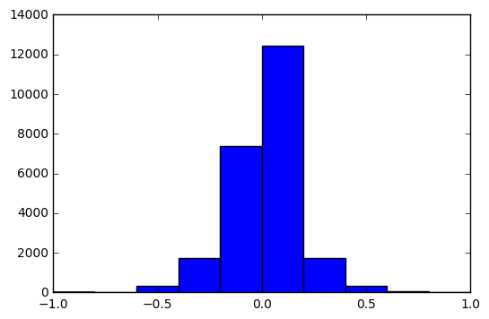
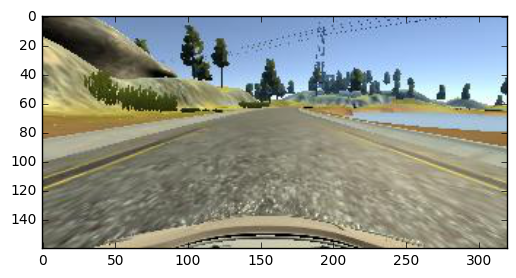
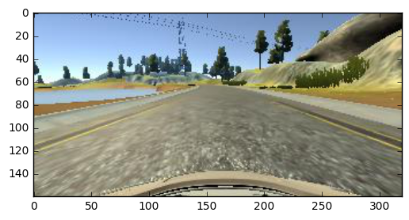
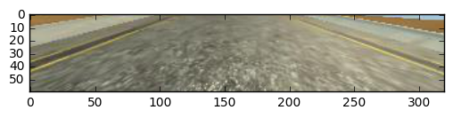

**Behavioral Cloning Project**

The goals / steps of this project are the following:
* Use the simulator to collect data of good driving behavior
* Build, a convolution neural network in Keras that predicts steering angles from images
* Train and validate the model with a training and validation set
* Test that the model successfully drives around track one without leaving the road
* Summarize the results with a written report

## Rubric Points
Here I will consider the [rubric points](https://review.udacity.com/#!/rubrics/432/view) individually and describe how I addressed each point in my implementation.  

---
### Files Submitted & Code Quality

#### 1. Submission includes all required files and can be used to run the simulator in autonomous mode

My project includes the following files:
* model.py containing the script to create and train the model
* drive.py for driving the car in autonomous mode
* model.h5 containing a trained convolution neural network
* writeup_report.md summarizing the results

#### 2. Submission includes functional code

Using the simulator and a drive.py file provided by Udacity, the car can be driven autonomously around the track by executing

```sh
python drive.py model.h5
```

#### 3. Submission code is usable and readable

The model.py file contains the code for training and saving the convolution neural network. The file shows the pipeline I used for training and validating the model, and it contains comments to explain how the code works.

### Model Architecture and Training Strategy

#### 1. An appropriate model architecture has been employed

My model consists of a convolution neural network with 5x5 and 3x3 filter sizes and depths between 32 and 128 (see function `model_init`)

The model includes RELU layers to introduce nonlinearity, and the data is normalized in the model using a Keras lambda layer.

#### 2. Attempts to reduce overfitting in the model

 - The model contains dropout layer to reduce overfitting
 - The model is trained and validated using cross validation
 - The model is tested using the simulator to ensure the vehicle stay on the track

#### 3. Model parameter tuning

The model used an adam optimizer, so the learning rate was not tuned manually (model.py line 25).

#### 4. Appropriate training data

I am a bad game player. I gave up having the vehicle cloning my behavior after a few trials. I use the data provided by Udacity course. The model is trained using all images from left, center, and right camera.

I also recorded around 10K recovering images from the left and right sides of the road. See details in next section how I generate new data.

### Model Architecture and Training Strategy

#### 1. Solution Design Approach

The overall strategy is to train models with incremental data and see the improvement in the simulator, and iterate the process.

My first step was to use something similar to Lenet, which I was familiar with and could give me a first hands-on experience on how Lenet would work for this generalized prediction task.

The data set is split into training and validation set. I also augmented the data using flipping and cropping. To add more data, I recorded recovering images to train the model as well. The model did a good job on training and validation; both training and validation error were low. (Error was measured by mean squared error). The vehicle can pass the road test when its speed is below 15.

To prevent overfitting, I added Dropout layer.

Lenet can't perform well when speed goes too high (over 16), so I selected another model that had deeper layers, and trained the new model with collected data (around 44K in total).

In sum, the design and experiment interweave. Finally the vehicle can drive by itself around the track.

#### 2. Final Model Architecture

The final model architecture (model.py function `model_init`) consisted of a convolution neural network with the following layers and layer sizes:

 1. normalization layer and cropping layer
 2. conv2D, 24 depth with 5x5 kernel size, strides 2x2
 3. conv2D, 36 depth with 5x5 kernel size, strides 2x2
 4. conv2D, 48 depth with 3x3 kernel size, strides 2x2
 5. conv2D, 64 depth with 3x3 kernel size
 6. conv2D, 64 depth with 3x3 kernel size
 7. dropout with radio 0.2
 8. flatten
 9. fully connected, shrink to size 100
 10. fully connected, shrink to size 50
 11. fully connected, shrink to size 1, the answer

Loss is measured by mean squared error. Since optimizer is using Adam, so no manual tuning is needed.

#### 3. Creation of the Training Set & Training Process

Here are the overall training process:

Initially the model was derived from Lenet, trained with all center images provided by Udacity. The result was that vehicle always went straight.

After exploring the data, I found that the given data has too many images with steering angle 0, so that could be the reason. I cleaned 20%~50% of the total center images that had steering angle 0. With these cleaned data, the vehicle performed much better, but still sometimes went out of track.

Here are the histogram of images before and after clean.




Then I collected recovering images (around 3k center images), and trained the model with these new images. The vehicle still went off track, and sometimes drove towards the side of road because it picked up the behavior of the moment when it drove towards the side while the recovering data was collected.

I thought the data is not enough, so I preprocessed images: flipping images to double the total number of images, and cropping images (cut off top 75 pixels, and bottom 25 pixels) The vehicle could stay on track most of the time, but it swung when the speed went beyond 16.




Here is its cropped image.



At this point, my training data had 10k images. I thought I still didn't have enough data, so I added images from the left camera and right camera with augmented steering angle (left augmented with `0.15`, and right `-0.15`)

The model was then trained with 44k images in total, split out 25% as validation test set for each epoch. Training was done in 4 epochs. Keras always reported small loss and validation loss, but the vehicle still sometimes went off the track on high speed (speed > 20). So I realized I needed to improve the model.

New model was derived from Nvidia's model (see previous subsection). When the model was trained using the same data, the vehicle drove smoothly. In sum, the design and experiment interweave. The network in the model should be deep enough to capture the nature of images, and training images should be also be good enough to express its nature.
